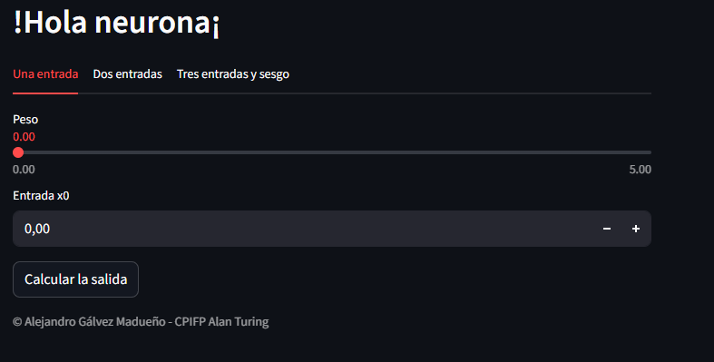
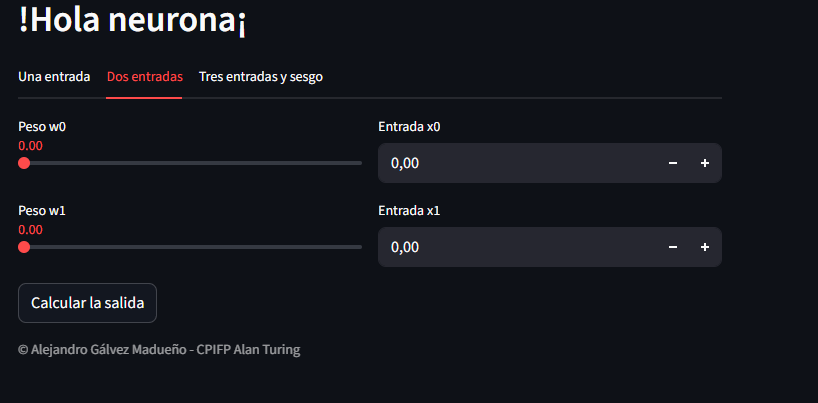
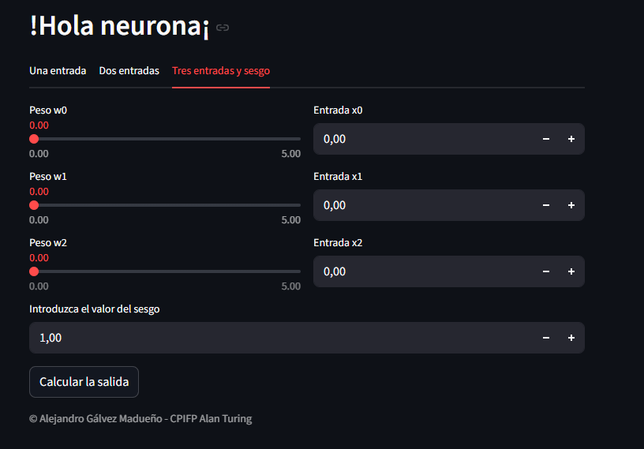

# Simulador de Neurona Artificial
### ¡Hola Neurona! - Una aplicación interactiva para entender el funcionamiento básico de una neurona artificial

**Autor:** `Alejandro Gálvez`

# Descripción del proyecto

Esta aplicación web interactiva, desarrollada con Streamlit, permite experimentar y visualizar el funcionamiento básico de una neurona artificial. A través de una interfaz amigable, los usuarios pueden modificar pesos, entradas y sesgos para comprender cómo se calcula la salida de una neurona en redes neuronales.

# Características Principales

* Interfaz interactiva con tres modos de operación

* Control deslizante para ajustar pesos de conexiones

* Entradas numéricas para valores de entrada

* Cálculo en tiempo real de la salida neuronal

* Visualización intuitiva del proceso de cálculo


# Estructura de la Aplicación

| Configuración | Fórmula |
|--------------|---------|
| 1 Entrada | $y = w_0 x_0$ |
| 2 Entradas | $y = w_0 x_0 + w_1 x_1$ |
| 3 Entradas + Sesgo | $y = w_0 x_0 + w_1 x_1 + w_2 x_2 + b$ |

# Visualización 

[Web Desplegada](https://agalmad-hola-neurona-streamlit-app-8cxuwd.streamlit.app/)

<div style="display: flex; flex-direction: column; gap: 20px">
  
  
  
</div>

# Instalación y ejecución

### Método 1: Ejecución local

1. Clonar o descargar el proyecto

```bash
git clone https://github.com/AGALMAD/hola-neurona
```

2. Crear un entorno virtual (recomendado)

```bash
python -m venv venv
source venv/bin/activate  # En Windows: venv\Scripts\activate
```

3. Instalar dependencias

```bash
pip install -r requirements.txt
```

4. Ejecutar la aplicación

```bash
streamlit run streamlit_app.py
```

### Método 2: Usando Docker (recomendado)

```bash
docker compose build
docker compose up
```
